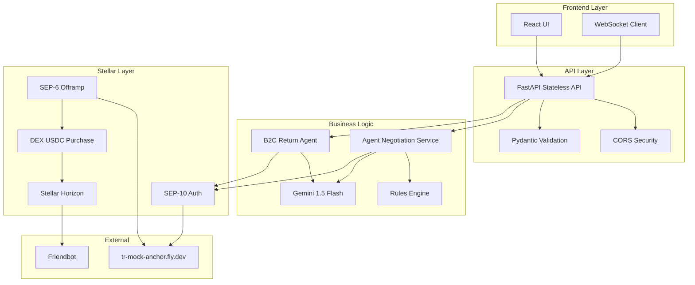
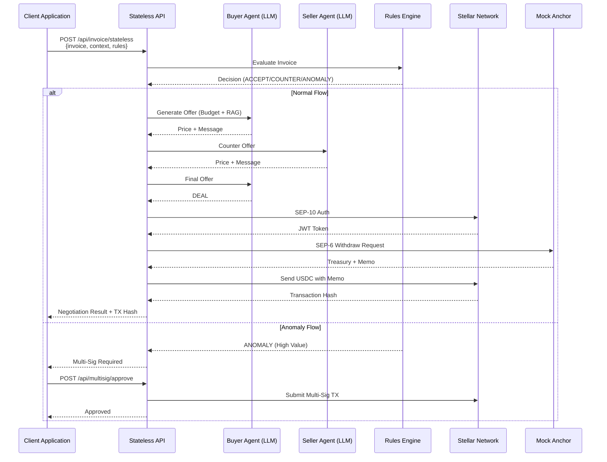
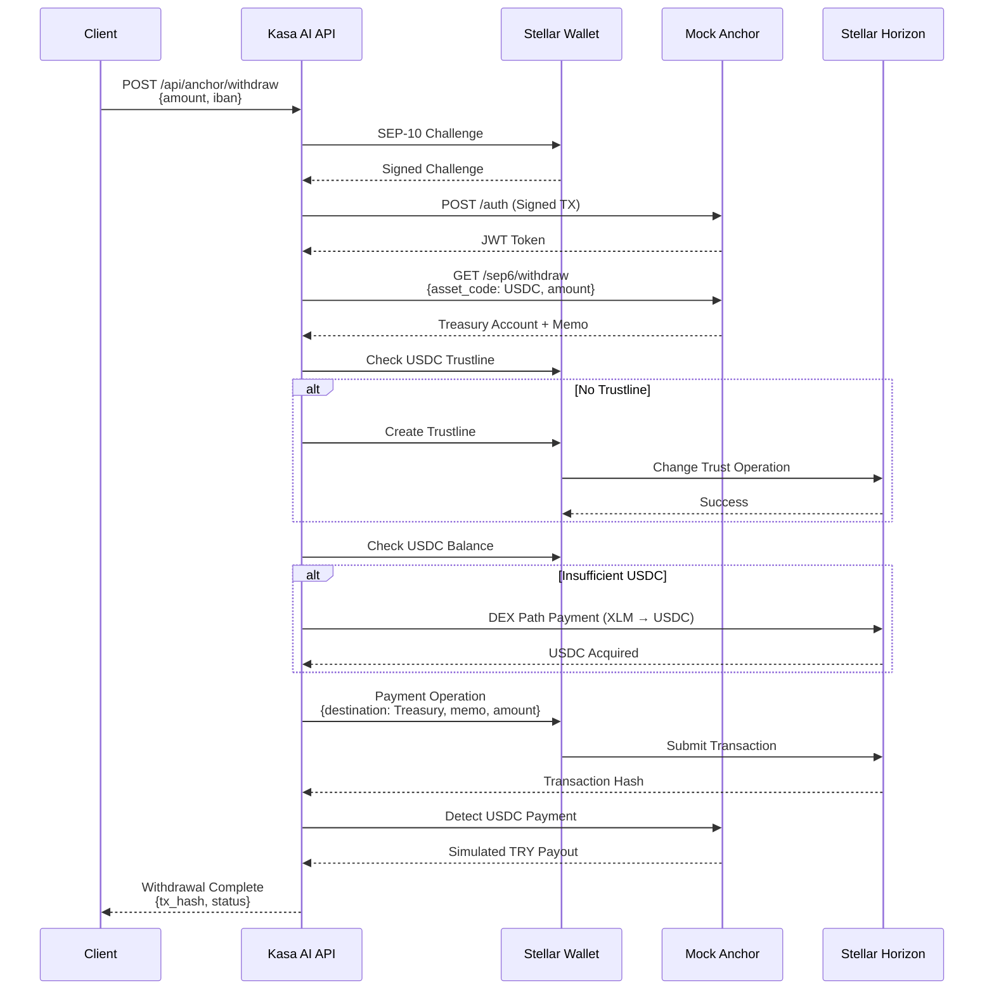

# Kasa AI 🚀
### Autonomous AI Negotiation & Instant On-Chain Settlement

**A submission for the Rise In × Stellar Pro Hackathon 2026 · Genesis Track**

---

## 🌟 Overview

**Kasa AI** is a next-generation autonomous payment orchestrator designed to eliminate the friction of financial disputes and invoice reconciliation. By leveraging **Gemini 1.5 Flash** agents and the **Stellar Network**, Kasa AI automates complex negotiations for both B2B procurement and B2C customer returns.

The system doesn't just talk—it settles. Every successful negotiation culminates in an automated on-chain transaction via **Stellar SEP-6**, ensuring that once agents agree on a price, the money moves instantly and transparently.

### 🎯 Hackathon Context

- **Event:** Rise In × Stellar Pro Hackathon 2026
- **Track:** Genesis Track
- **Date:** September 19-20, 2026
- **Location:** Grand Pera, Beyoğlu, Istanbul
- **Mock Anchor:** [tr-mock-anchor.fly.dev](https://tr-mock-anchor.fly.dev)
- **Architecture:** **Stateless API** - Enterprise-grade, context-based, no internal state storage
- **Network:** Stellar Testnet
- **Asset:** USDC (GBBD47IF6LWK7P7MDEVSCWR7DPUWV3NY3DTQEVFL4NAT4AQH3ZLLFLA5)

---

## ✨ Key Features

### 🤝 Dual-Agent Negotiation Protocol
Watch in real-time as a "Buyer Agent" and a "Seller Agent" negotiate terms over WebSockets. They analyze budgets, rules, and market conditions to reach a fair "Deal" without human intervention.

### 🧠 RAG-Driven Corporate Memory
Our agents aren't just smart; they have memory. Using **Retrieval-Augmented Generation (RAG)**, agents consult past invoices and supplier history to detect price gouging or favorable loyalty terms.

### 🛡️ Multi-Sig CFO Safeguards
For high-value transactions or suspicious anomalies, Kasa AI triggers a **Multi-Sig sequence**. The payment is frozen on the Stellar ledger until a human administrator (CFO) provides the second signature via a secure dashboard.

### 💸 Autonomous Split Refunds (B2C)
Kasa AI introduces the **Karma İade (Split Refund)** logic. If a customer wants a partial cash refund and partial store credit, the agents calculate the split, verify return shipping requirements, and execute the SEP-6 offramp for the cash portion automatically.

### 🌍 Fully Bilingual (TR/EN)
A unified interface and backend that supports seamless switching between Turkish and English. The AI agents dynamically adjust their negotiation tone, language, and cultural nuances based on the user's preference.

### 🔒 Enterprise-Grade Stateless API
Kasa AI is built as a **stateless API engine** - perfect for enterprise integration. All context (rules, past invoices, wallet keys) is provided by the client in each request. No internal state storage, no database dependencies, pure functional architecture.

---

## 🏗️ Architecture

### Tech Stack

| Layer | Technology | Purpose |
|-------|-----------|---------|
| **Backend** | Python / FastAPI | High-performance async API |
| **AI Engine** | Gemini 1.5 Flash | LLM-powered negotiation agents |
| **Blockchain** | Stellar SDK 12.1.0 | SEP-6 Offramps, SEP-10 Auth, Multi-Sig |
| **Frontend** | React 19 / Vite 8 / Tailwind CSS 4 | Real-time agent console |
| **WebSocket** | Native WebSocket | Live agent communication |
| **Validation** | Pydantic 2.10 | Enterprise-grade input validation |
| **HTTP Client** | httpx 0.28.1 | Async HTTP requests |

### System Architecture



---

## 🔄 B2B Negotiation Flow



---

## 💰 SEP-10/SEP-6 Off-Ramp Flow



---

## 🚀 Getting Started

### Prerequisites

- **Python:** 3.9+
- **Node.js:** 18+
- **Google AI API Key:** [Get Gemini API Key](https://makersuite.google.com/app/apikey)
- **Stellar Wallet:** [Freighter](https://freighter.app) or [demo-wallet.stellar.org](https://demo-wallet.stellar.org)

### Environment Configuration

Create a `.env` file in the `backend/` directory. You can copy the provided `.env.example` as a template:

```bash
cp backend/.env.example backend/.env
```

Then edit `backend/.env` with your values:

```env
# Required
GEMINI_API_KEY=your_gemini_api_key_here

# Optional: Gemini model (default: gemini-1.5-flash)
GEMINI_MODEL=gemini-1.5-flash

# Stellar Configuration
STELLAR_NETWORK=TESTNET
STELLAR_SECRET_KEY=  # Optional: Auto-generated if not provided

# CORS Security (comma-separated origins)
ALLOWED_ORIGINS=http://localhost:5173,http://localhost:3000

# Anchor Configuration (defaults provided)
# ANCHOR_HOME=https://tr-mock-anchor.fly.dev
# HORIZON_URL=https://horizon-testnet.stellar.org
# FRIENDBOT_URL=https://friendbot.stellar.org
```

### Backend Setup

```bash
cd backend

# Create virtual environment
python -m venv venv

# Activate virtual environment
source venv/bin/activate  # On Windows: venv\Scripts\activate

# Install dependencies from requirements.txt
pip install -r requirements.txt

# Start the server
python -m app.main
```

**Backend will run on:** `http://127.0.0.1:8000`

**API Documentation:** `http://127.0.0.1:8000/docs` (Swagger UI)

**Quick Start:** Use the provided `dev.sh` script to start both backend and frontend simultaneously:
```bash
./dev.sh all
```

### Frontend Setup

```bash
cd frontend

# Install dependencies
npm install

# Start development server
npm run dev
```

**Frontend will run on:** `http://127.0.0.1:5173`

---

## 📡 API Endpoints

### Stateless API (Recommended for New Integrations)

#### B2B Invoice Negotiation
```http
POST /api/invoice/stateless
Content-Type: application/json

{
  "invoice": {
    "supplier": "Kağıt Tedarik A.Ş.",
    "product": "bardak",
    "quantity": 500,
    "amount": 480.0
  },
  "context": {
    "past_invoices": [
      {
        "supplier": "Kağıt Tedarik A.Ş.",
        "product": "bardak",
        "amount": 400.0,
        "date": "1 month ago"
      }
    ],
    "rules": [
      {
        "id": "rule-123",
        "supplier": "Kağıt Tedarik A.Ş.",
        "budget_limit": 450.0,
        "anomaly_threshold": 900.0,
        "product_hint": "bardak"
      }
    ],
    "wallet_public_key": "GABCD...XYZ"
  },
  "lang": "tr"
}
```

#### B2C Return Negotiation
```http
POST /api/return/stateless
Content-Type: application/json

{
  "return_request": {
    "text": "Siyah Deri Ceket, 5000 TL",
    "lang": "tr"
  },
  "context": {
    "wallet_public_key": "GABCD...XYZ"
  }
}
```

### Legacy API (Backward Compatible)

| Endpoint | Method | Description |
|----------|--------|-------------|
| `/api/invoice` | POST | Submit invoice (stateful) |
| `/api/return` | POST | Submit return (stateful) |
| `/api/rules` | GET/POST/DELETE | Rule management |
| `/api/rules/parse` | POST | Parse natural language rule |
| `/api/negotiations` | GET | List negotiations |
| `/api/anomaly/approve` | POST | Approve anomaly |
| `/api/anomaly/reject` | POST | Reject anomaly |
| `/api/multisig/approve` | POST | Approve multi-sig |
| `/api/balance` | GET | Get wallet balance |
| `/api/wallet/fund` | POST | Fund wallet (Friendbot) |
| `/api/wallet/connect` | POST | Connect wallet |
| `/api/sep10/challenge` | POST | Get SEP-10 challenge |
| `/api/sep10/token` | POST | Get SEP-10 token |
| `/api/anchor/withdraw` | POST | SEP-6 withdraw |
| `/api/transactions` | GET | Transaction history |
| `/api/logs` | GET | System logs |

### WebSocket Endpoints

| Endpoint | Description |
|----------|-------------|
| `/ws/agent-console` | Live agent negotiation console |
| `/ws/agents` | Buyer/seller agent mesh network |

---

## 🛠️ Usage Flow

### 1. Onboarding
- Connect your Stellar wallet or let the system auto-generate a funded Testnet account
- Friendbot automatically funds your account with XLM

### 2. Define Rules
- Set your corporate spending limits (e.g., "Max 500 TL for office supplies")
- Rules can be defined via natural language or form interface

### 3. Trigger Negotiation
- **B2B:** Submit an invoice from a supplier
- **B2C:** Start a customer return request

### 4. The Console
- Open the **Agent Console** to see the agents negotiate in real-time
- Watch buyer and seller agents exchange offers
- View RAG-driven arguments based on past invoices

### 5. Settlement
- Once a "DEAL" is reached, the system automatically:
  - Authenticates via SEP-10
  - Initiates SEP-6 off-ramp
  - Sends USDC on-chain to Mock Anchor treasury
  - Anchor simulates TRY payout to IBAN

### 6. Verification
- Verify the transaction on [Stellar Expert](https://stellar.expert)
- Check transaction history in the Balance page

---

## 🎥 Demo

[Demo Video Linki Gelecek]

**Demo Highlights:**
- Real-time agent negotiation console
- B2B invoice negotiation with RAG
- B2C split refund logic
- SEP-10 authentication flow
- SEP-6 off-ramp execution
- Multi-sig CFO approval

---

## 🔒 Security Features

### Enterprise-Grade Error Handling

All errors return standardized JSON responses with appropriate HTTP status codes:

```json
{
  "success": false,
  "error": "Error message",
  "error_code": "ERROR_CODE",
  "details": [
    {
      "field": "field_name",
      "message": "Detailed error message",
      "code": "error_code"
    }
  ],
  "timestamp": "2026-09-17T15:14:00"
}
```

### CORS Security

- Environment-based origin whitelist
- Default: `http://localhost:5173,http://localhost:3000`
- Configurable via `ALLOWED_ORIGINS` env variable

### Input Validation

- Pydantic models with strict validation
- Field length constraints
- Pattern matching (IBAN, Stellar public keys)
- Range validation (amounts, quantities)

### API Key Protection

- No API keys stored in code
- Environment variable configuration
- `.env.example` provided for setup

---

## 📊 Error Codes

| Error Code | Description | HTTP Status |
|------------|-------------|-------------|
| `MISSING_API_KEY` | GEMINI_API_KEY not configured | 422 |
| `LLM_QUOTA_EXCEEDED` | Gemini API quota exceeded | 429 |
| `LLM_TIMEOUT` | LLM API connection timeout | 504 |
| `SEP10_CHALLENGE_ERROR` | SEP-10 challenge request failed | 400 |
| `SEP10_AUTH_ERROR` | SEP-10 authentication failed | 401 |
| `ANCHOR_TIMEOUT` | Anchor server timeout | 504 |
| `DEX_PATH_ERROR` | DEX path query failed | 502 |
| `ACCOUNT_NOT_FOUND` | Stellar account not found | 404 |
| `TRANSACTION_ERROR` | Stellar transaction failed | 400 |
| `VALIDATION_ERROR` | Input validation failed | 422 |

---

## 🧪 Testing

### Manual Testing

1. **Health Check**
   ```bash
   curl http://127.0.0.1:8000/api/health
   ```

2. **Test Stateless Invoice**
   ```bash
   curl -X POST http://127.0.0.1:8000/api/invoice/stateless \
     -H "Content-Type: application/json" \
     -d '{
       "invoice": {"supplier": "Test", "product": "item", "quantity": 1, "amount": 100},
       "context": {"past_invoices": [], "rules": [], "wallet_public_key": null},
       "lang": "tr"
     }'
   ```

3. **Test WebSocket**
   ```bash
   wscat -c ws://127.0.0.1:8000/ws/agent-console
   ```

---

## 📚 Mock Anchor Integration

### Anchor Details

- **Home Domain:** `tr-mock-anchor.fly.dev`
- **Network:** Stellar Testnet
- **Asset:** USDC
- **USDC Issuer:** `GBBD47IF6LWK7P7MDEVSCWR7DPUWV3NY3DTQEVFL4NAT4AQH3ZLLFLA5`
- **Treasury:** `GCLCZEQZ2THTEDAOFI66LACNPLY4OBKN7VKLEZFMBIHYKYQOW2W7T3Z6`

### SEP Standards Implemented

- **SEP-1:** stellar.toml discovery
- **SEP-6:** Deposit/Withdraw operations
- **SEP-10:** Challenge-response authentication
- **SEP-12:** Simulated KYC (auto-approved)
- **SEP-38:** Price quotes (optional)

### Limits

- **Deposit:** 50.00 - 3,000 TRY
- **Withdraw:** Minimum 1.0000000 USDC
- **TRY:** 2 decimal places
- **USDC:** 7 decimal places

---

## 🌐 Resources

- **Mock Anchor:** [https://tr-mock-anchor.fly.dev](https://tr-mock-anchor.fly.dev)
- **Mock Anchor Explorer:** [https://tr-mock-anchor.fly.dev/explorer](https://tr-mock-anchor.fly.dev/explorer)
- **Stellar Developer Docs:** [https://developers.stellar.org](https://developers.stellar.org)
- **Stellar Lab:** [https://lab.stellar.org](https://lab.stellar.org)
- **Stellar Expert:** [https://stellar.expert](https://stellar.expert)
- **Circle USDC Faucet:** [https://faucet.circle.com](https://faucet.circle.com)
- **Stellar AI Skills:** [https://skills.stellar.org](https://skills.stellar.org)

---

## 🤝 Contributing

This is a hackathon submission. For inquiries or collaboration, please contact the development team.

---

## 📄 License

MIT License - Developed for the Rise In × Stellar Pro Hackathon 2026

---

## 🙏 Acknowledgments

- **Rise In** for organizing the hackathon
- **Stellar Development Foundation** for the blockchain infrastructure
- **Google** for Gemini 1.5 Flash AI
- **Mock Anchor Team** for the testnet TRY/USDC ramp

---

**Developed with ❤️ for the Stellar Community**

*Built for the Rise In × Stellar Pro Hackathon 2026 · Genesis Track*
