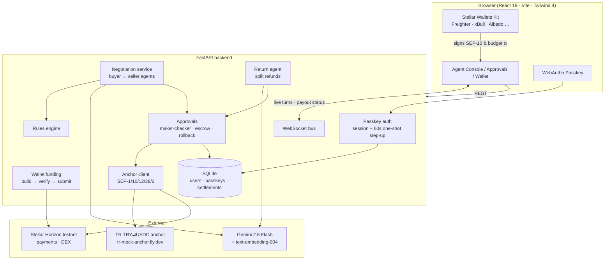
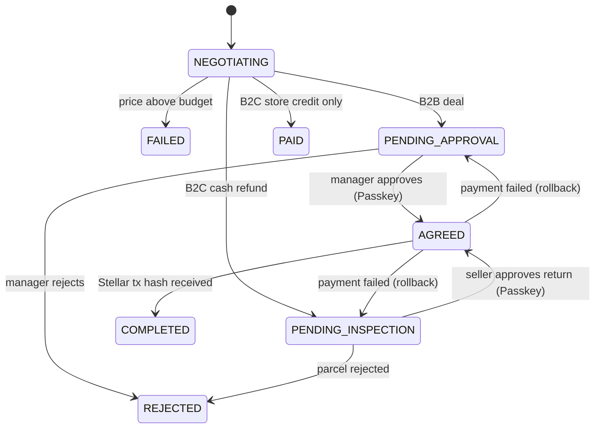
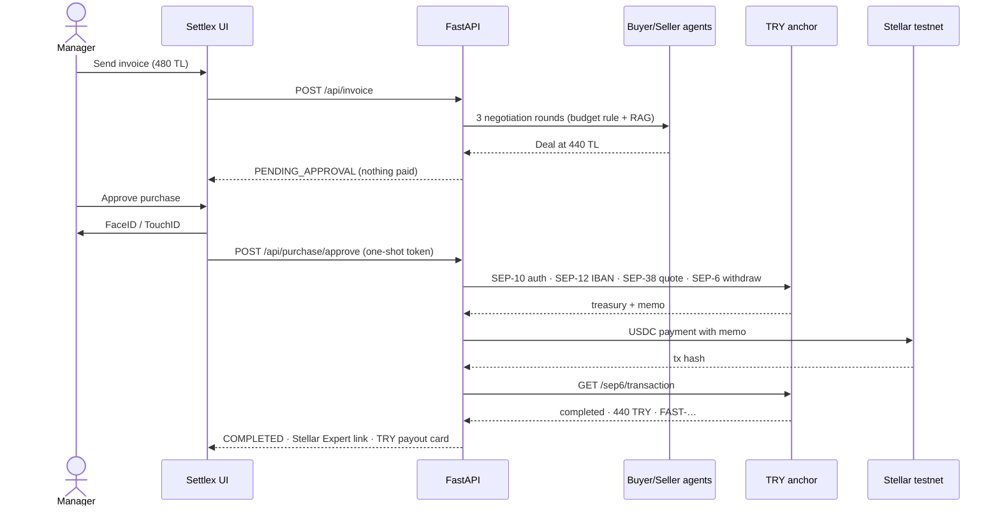
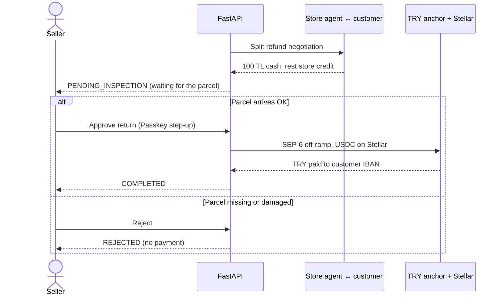
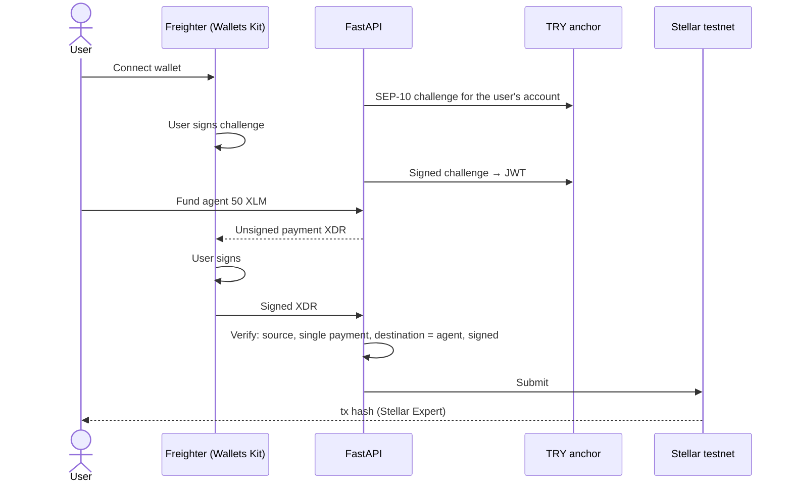

<p align="center">
  
</p>

<h1 align="center">Settlex</h1>

<p align="center">
  <b>AI agents negotiate B2B invoices and B2C returns, a human approves with a Passkey, and the money settles on Stellar and lands in Turkish lira.</b>
</p>

<p align="center">
  Rise In × Stellar Pro Hackathon 2026 · <b>Genesis Track</b> · Stellar Testnet
</p>

---

## 🔗 Links

| | |
|---|---|
| **Live Project Link** | https://hammerhead-app-hfcgi.ondigitalocean.app |
| **Pitch deck** |[Presentation File(pdf)](./Settlex-Stellar-Pro-Hackathon-2026.pdf)|
| **Repository** | https://github.com/musa-ok/settlex-stellar-hackathon |

---

## Contents

1. [The problem](#-the-problem)
2. [What Settlex does](#-what-settlex-does)
3. [Hackathon requirements at a glance](#-hackathon-requirements-at-a-glance)
4. [Features](#-features)
5. [Verified on Stellar testnet](#-verified-on-stellar-testnet)
6. [Architecture](#-architecture)
7. [Flows](#-flows)
8. [Getting started](#-getting-started)
9. [How to test it (judge walkthrough)](#-how-to-test-it-judge-walkthrough)
10. [API reference](#-api-reference)
11. [Security](#-security)
12. [Design decisions & trade-offs](#-design-decisions--trade-offs)
13. [Challenges we solved](#-challenges-we-solved)
14. [Stellar skills & tools used](#-stellar-skills--tools-used)
15. [Traction & user onboarding](#-traction--user-onboarding)
16. [Roadmap](#-roadmap)
17. [Team](#-team)

---

## 🧩 The problem

Invoice reconciliation between companies and customer refunds are still manual, slow and expensive:

- **B2B:** a procurement team receives an invoice above the agreed budget. Someone emails the supplier, haggles over a few rounds, gets a manager to sign off, and finance finally wires the money days later.
- **B2C:** a customer wants a refund. Support negotiates store credit vs. cash, the cash goes out before the parcel is even back, and refund fraud eats the margin.

Every step needs a person, the approvals live in email threads, and cross-border or crypto payments still have to end up as **Turkish lira in a bank account** to be useful.

## 💡 What Settlex does

Settlex is an **autonomous payment agent with human guardrails**:

1. **AI agents negotiate.** A buyer agent and a seller agent (Gemini 2.5 Flash) bargain over the invoice or refund in a few rounds, bounded by the company's rules and budget and informed by past invoices (RAG).
2. **No money moves on its own.** An agreed purchase waits for a **manager's approval (maker-checker)**; an agreed cash refund is **held in escrow until the returned parcel is inspected**.
3. **Approval happens with a fingerprint.** Every approval triggers a fresh **Passkey (FaceID / TouchID)** check that the backend verifies.
4. **Settlement is real.** The payment goes on-chain as USDC on Stellar and is cashed out to a **Turkish IBAN in TRY** through a Stellar anchor (SEP-1 / 10 / 12 / 38 / 6).
5. **The company funds the agent from its own wallet** (Freighter or any wallet via Stellar Wallets Kit).

**Who it is for:** procurement and finance teams, suppliers who want faster payment, and e-commerce shops handling returns.

**Value:** negotiations that took days finish in seconds, spending stays inside policy, humans approve only what matters, and every payment has an on-chain receipt and a TRY payout reference.

---

## ✅ Hackathon requirements at a glance

| Requirement | How Settlex meets it | Where in the code |
|---|---|---|
| **1. Integration** (eligible partner) | **Stellar Wallets Kit** connects Freighter, xBull, Albedo, Lobstr, … The connected wallet signs the SEP-10 login with the anchor and the budget transfer to the agent. | [`frontend/src/wallet.js`](frontend/src/wallet.js), [`hooks/useWallet.js`](frontend/src/hooks/useWallet.js), [`components/WalletPanel.jsx`](frontend/src/components/WalletPanel.jsx), [`backend/app/wallet_funding.py`](backend/app/wallet_funding.py) |
| **2. Anchor / local payments** (TRY fiat rail) | TRY ⇄ USDC anchor **`tr-mock-anchor.fly.dev`**: SEP-1 discovery, SEP-10 auth, SEP-12 payout IBAN, SEP-38 TRY→USDC quote, SEP-6 withdraw, and polling of the anchor's TRY payout status. | [`backend/app/stellar_anchor.py`](backend/app/stellar_anchor.py) |
| **3. Core feature** | Settlement *is* the product: every approved purchase and every escrowed refund ends in a Stellar payment and a TRY payout. Nothing is paid without it. | [`backend/app/approvals.py`](backend/app/approvals.py) |
| **Deployed on testnet** | All payments run on Stellar testnet (Horizon testnet). | — |
| **Passkeys** (nice-to-have) | WebAuthn login and a step-up biometric check before each payment approval. | [`backend/app/passkeys.py`](backend/app/passkeys.py) |

---

## ✨ Features

### 🤝 AI-to-AI negotiation (B2B & B2C)
- **B2B:** the seller agent opens at the invoice price, the buyer agent counters within the budget rule, and the seller closes, never below 90% of the invoice. Every turn streams live over WebSocket into a messenger-style console.
- **B2C:** a store agent and a simulated customer negotiate **split refunds** (part cash, part store credit). The coupon rate is computed by the system, not invented by the LLM.
- **On-the-fly RAG:** past invoices sent with a stateless request are embedded with `text-embedding-004`, ranked by cosine similarity (NumPy), and the top 3 are injected into the buyer agent's prompt.
- **Rules engine:** spending rules in natural language or via a form ("max 450 TL for cups from Kağıt Tedarik").

### 🛡️ Maker-checker purchases
When the agents agree, the purchase is stored as **`PENDING_APPROVAL`**. Nothing is paid until a manager approves on the **Approvals** card; the manager can also **reject** (`REJECTED`).

### 📦 Escrow refunds
An agreed cash refund becomes **`PENDING_INSPECTION`**. The seller releases it with **"Approve Return"** once the parcel arrives, or **rejects** it if the parcel is damaged or never arrives. Refunds settled fully as store credit need no cash and no approval.

### 👆 Biometric approval at signing time
Pressing *Approve* opens FaceID / TouchID again. The backend only accepts a token that came from a WebAuthn assertion made **in the last 60 seconds**, and it can be used **once**. A stolen session token cannot approve a payment.

### 🔁 Fault-tolerant settlement
A payment is `COMPLETED` **only** when Stellar returns a transaction hash. If the anchor, Horizon or the DEX fails, the payment goes back to `PENDING_APPROVAL` / `PENDING_INSPECTION`, the database row is rolled back, and the API answers `502 SETTLEMENT_FAILED` so the user can retry. A double click cannot pay twice.

### 🇹🇷 Real TRY off-ramp
1. The agreed amount is in **TRY**, and the **SEP-38** quote converts it to USDC including the anchor's spread.
2. **SEP-12** registers the payout IBAN.
3. **SEP-6** returns the treasury account and a memo, and the agent sends USDC on Stellar (buying USDC on the Stellar DEX with XLM if needed).
4. Settlex polls SEP-6 `/transaction` and shows the anchor's result in the console: **"150.00 TRY · FAST-… · completed"**.

### 👛 Company wallet (Stellar Wallets Kit)
A three-step card on the home page:
1. Connect Freighter or any other supported wallet.
2. Verify with the TRY anchor: the SEP-10 challenge is signed **in the user's wallet**, so no password or API key is needed.
3. Fund the AI agent: the backend builds the payment, the wallet signs it, and the backend checks that it is exactly one payment to the agent before submitting it.

### 🧾 Proof everywhere
Every settlement is stored in SQLite with its `tx_hash`. The console shows a **Stellar Expert** link and the anchor's TRY payout card.

### 🌍 Bilingual & mobile-first
The UI and the agents' negotiation language switch between Turkish and English. The layout is responsive, with touch-friendly controls.

---

## 🔎 Verified on Stellar testnet

These transactions were produced by the running system during development:

| What | Result | Proof |
|---|---|---|
| Purchase approved → TRY payout | 150 TL deal → SEP-38 quote → **3.0901616 USDC** sent → anchor paid **150.00 TRY** (`FAST-SZJ8PP42A8`) | [tx 0603ce54…](https://stellar.expert/explorer/testnet/tx/0603ce54f6ba31ac7a9f10e1b5387dd6d0f53ed2498a296cf1de63d52313378b) |
| Off-ramp | 1 USDC → **48.54 TRY** via FAST (`FAST-CM5SG8HJG1`) | [tx 52b06cdd…](https://stellar.expert/explorer/testnet/tx/52b06cddde9a858874da54410a92139c72d9bab3d79a7f0858ebe79c1e93d9f2) |
| DEX top-up | XLM → USDC path payment for the agent wallet | [tx b183e4d5…](https://stellar.expert/explorer/testnet/tx/b183e4d56abe65f0b00ae9e0a3d142059c643ce50ccd2cb119f4c442c9c8a0ff) |
| Company funds the agent | 25 XLM, signed by the company wallet, verified and submitted by the backend | [tx e5cca875…](https://stellar.expert/explorer/testnet/tx/e5cca875e34eaf9194bcf4478e5dba095f186faf2ee1d3281035ca9f58919476) |

- **Agent wallet:** [`GCO7KVCZ…CPBM`](https://stellar.expert/explorer/testnet/account/GCO7KVCZRALTIDDX7AXPLVHTOV72JVSOSMCMDADR3WOIUO3O6AKACPBM)
- **Anchor treasury:** [`GCLCZEQZ…T3Z6`](https://stellar.expert/explorer/testnet/account/GCLCZEQZ2THTEDAOFI66LACNPLY4OBKN7VKLEZFMBIHYKYQOW2W7T3Z6)

---

## 🏗️ Architecture



### Components

| Component | File | Responsibility |
|---|---|---|
| Negotiation service | `backend/app/agent_negotiation.py` | 3-step buyer/seller loop, RAG, anomaly detection, holds agreed purchases |
| Return agent | `backend/app/return_agent.py` | B2C split-refund negotiation, holds cash refunds in escrow |
| Approvals | `backend/app/approvals.py` | Approve → settle (COMPLETED only with tx hash) or roll back; reject |
| Anchor client | `backend/app/stellar_anchor.py` | SEP-1 discovery, SEP-10, SEP-12, SEP-38, SEP-6, USDC payment, payout polling |
| Wallet funding | `backend/app/wallet_funding.py` | Unsigned budget tx for the user's wallet, strict verification before submit |
| Passkeys | `backend/app/passkeys.py` | WebAuthn register/login, sessions, `require_fresh_passkey` step-up |
| Persistence | `backend/app/db.py` | SQLite: users, credentials, settlements with status + `tx_hash` |
| Frontend | `frontend/src/` | Console, approvals cards, wallet panel, balance & anchor page |

### Payment state machine



### Tech stack

| Layer | Technology |
|---|---|
| Backend | Python 3.11+, FastAPI 0.115, Pydantic 2, Uvicorn |
| AI | Google Gemini 2.5 Flash (negotiation), `text-embedding-004` + NumPy (RAG) |
| Stellar | `stellar-sdk` 12 (Python), Horizon testnet, classic DEX path payments |
| Anchor | SEP-1, SEP-10, SEP-12, SEP-38, SEP-6 via `httpx` |
| Wallets | `@creit.tech/stellar-wallets-kit` 2.6 |
| Auth | WebAuthn (`webauthn` 2.5) Passkeys |
| Storage | SQLite + SQLAlchemy 2 |
| Frontend | React 19, Vite 8, Tailwind CSS 4, native WebSocket |

---

## 🔄 Flows

### B2B: negotiation → manager approval → TRY payout



### B2C: escrow refund



### Company wallet funds the agent (Stellar Wallets Kit)



---

## 🚀 Getting started

### Prerequisites

- Python **3.11+** and Node.js **18+**
- A **Gemini API key**: https://aistudio.google.com/apikey
- A device with a platform authenticator (FaceID, TouchID or Windows Hello) for Passkeys
- *(optional)* the **Freighter** browser extension, set to **Testnet** and funded with Friendbot

### 1. Configure the backend

```bash
cp backend/.env.example backend/.env
# then set GEMINI_API_KEY in backend/.env
```

| Variable | Required | Purpose |
|---|---|---|
| `GEMINI_API_KEY` | ✅ | LLM negotiation |
| `ANCHOR_HOME` | ✅ for the TRY rail | `tr-mock-anchor.fly.dev`. Without it Settlex falls back to `testanchor.stellar.org` (no TRY). |
| `STELLAR_SECRET_KEY` | recommended in production | Agent wallet secret. If empty, one is generated and saved to `backend/.data/agent_secret` (gitignored). |
| `STELLAR_NETWORK` | — | `TESTNET` (default) |
| `ALLOWED_ORIGINS` | production | Comma-separated frontend origins for CORS |
| `WEBAUTHN_RP_ID` / `WEBAUTHN_ORIGIN` | production | Passkey domain, e.g. `settlex.example.com` / `https://settlex.example.com` |
| `DATABASE_URL` | — | Defaults to SQLite at `backend/.data/settlex.db` |
| `ASSET_CODE` / `ASSET_ISSUER` / `HORIZON_URL` | — | Defaults to testnet USDC `GBBD47…LFLA5` and Horizon testnet |

### 2. Run it

```bash
# backend
cd backend
python -m venv .venv && source .venv/bin/activate
pip install -r requirements.txt
uvicorn app.main:app --reload --host 127.0.0.1 --port 8000

# frontend (new terminal)
cd frontend
npm install
npm run dev -- --host 127.0.0.1 --port 5173
```

Or start both with `./dev.sh all` (after the first install).

Open **http://localhost:5173**. Use `localhost`, not `127.0.0.1`: browsers do not allow Passkeys on IP addresses. The API docs are at http://127.0.0.1:8000/docs.

### 3. Deploying

- **Frontend:** set `VITE_API_URL` (backend origin) and `VITE_WS_URL` (`wss://<backend>/ws/agent-console`), then `npm run build`.
- **Backend:** set `ANCHOR_HOME`, `STELLAR_SECRET_KEY`, `ALLOWED_ORIGINS`, `WEBAUTHN_RP_ID` and `WEBAUTHN_ORIGIN`. Passkeys require **HTTPS**.

---

## 🧪 How to test it (judge walkthrough)

1. **Register a Passkey:** top-right *Register Passkey*, then FaceID / TouchID.
2. **Connect a wallet** (home page, *Company Wallet* card): *Connect Wallet* → Freighter (Testnet) → *Verify with Anchor (SEP-10)* → sign in Freighter → *Send 50 XLM* → sign. A Stellar Expert link appears.
3. **B2B purchase** (*Agent Console*): keep *Kağıt Tedarik A.Ş.* / 480 TL and press *Send Invoice*. Watch the agents negotiate in the two chat columns and agree at or below the 450 TL budget.
4. **Maker-checker:** a card *Payments Awaiting Approval → Purchase · Awaiting Manager Approval* appears. Press *Approve Purchase (Manager)*, confirm with FaceID / TouchID, and watch:
   - the SEP-38 rate and SEP-6 steps in the log,
   - the **Stellar Expert** link,
   - the **Anchor TRY Payout** card (`… TRY · FAST-… · Completed`).
5. **Escrow refund:** type `Black leather jacket, 100 TL` in the B2C box and press *Customer Return*. The refund waits as *Awaiting Return Shipment* (also visible on the *Supplier* page). Approve it to pay, or press *Cancel / Reject* to cancel with no payment.
6. **Anomaly / CFO lock:** on the *Supplier* page press *Send Suspicious / Over Limit Invoice*. The console asks for the CFO's second signature.
7. **Balance & Anchor:** withdraw any amount to a TR IBAN and see the TRY result. All settlements are listed with their `tx_hash`.

Quick API checks:

```bash
curl http://127.0.0.1:8000/api/health
curl https://tr-mock-anchor.fly.dev/.well-known/stellar.toml   # the anchor we integrate
```

---

## 📡 API reference

Every endpoint that starts, approves, rejects or pays a payment needs `Authorization: Bearer <passkey session>`. The two *approve* endpoints (`/api/purchase/approve`, `/api/refund/approve`) need the **one-shot step-up token** from a fresh Passkey assertion instead. See [Security](#-security) for the few open helper endpoints.

| Endpoint | Method | Description |
|---|---|---|
| `/api/invoice` · `/api/invoice/stateless` | POST | Start a B2B negotiation (stateless variant takes rules + past invoices for RAG) |
| `/api/return` · `/api/return/stateless` | POST | Start a B2C refund negotiation |
| `/api/purchase/approve` | POST | Manager approves → settle → `COMPLETED` (step-up token, `502` + rollback on failure) |
| `/api/purchase/reject` | POST | Manager rejects → `REJECTED` |
| `/api/refund/approve` | POST | Parcel inspected → settle refund → `COMPLETED` (step-up token) |
| `/api/refund/reject` | POST | Parcel rejected → `REJECTED` |
| `/api/multisig/approve` · `/api/anomaly/approve` · `/api/anomaly/reject` | POST | CFO second signature for an anomalous invoice (Passkey session; `409` unless the invoice is waiting for the CFO) |
| `/api/negotiations` | GET | Negotiations in memory (incl. pending approvals) |
| `/api/sessions` | GET | Persisted settlements with `tx_hash` and Stellar Expert URL |
| `/api/anchor/withdraw` | POST | Direct SEP-6 off-ramp to a TR IBAN (Passkey session) |
| `/api/sep10/challenge` · `/api/sep10/token` | POST | SEP-10 with the anchor for a user-signed wallet |
| `/api/wallet/agent` | GET | The AI agent's settlement wallet |
| `/api/wallet/fund-agent/build` · `/submit` | POST | Company wallet → agent budget (wallet-signed) |
| `/api/wallet/fund` · `/api/wallet/connect` · `/api/balance` | POST/GET | Friendbot demo wallet, connect, balances |
| `/api/rules` · `/api/rules/parse` | GET/POST/DELETE | Spending rules, natural-language parsing |
| `/api/passkey/register/*` · `/login/*` · `/me` · `/logout` | POST/GET | WebAuthn Passkeys |
| `/api/health` · `/api/logs` · `/api/transactions` | GET | Health, logs, in-memory tx log |
| `/ws/agent-console` | WS | Live agent turns, `anchor_step`, `settlement`, `fiat_payout` events |

Errors use one JSON shape, `{"detail": {"error", "error_code", "message"}}`. Important codes:

| Code | HTTP | Meaning |
|---|---|---|
| `PASSKEY_REQUIRED` | 401 | Log in with a Passkey first |
| `PASSKEY_STEP_UP_REQUIRED` | 401 | Approval needs a fresh FaceID / TouchID confirmation |
| `INVALID_STATUS` | 409 | The payment is not waiting for this action (already paid, rejected, …) |
| `SETTLEMENT_FAILED` | 502 | Stellar / anchor payment failed; the payment is pending again and can be retried |
| `SOURCE_MISMATCH` · `UNEXPECTED_OPERATIONS` · `UNSIGNED` | 400 | Rejected wallet-signed transaction |
| `MISSING_API_KEY` | 422 | `GEMINI_API_KEY` not set |

---

## 🔒 Security

### Controls

| Risk | Control |
|---|---|
| **Someone triggers agents or payments without permission** | WebAuthn **Passkey** login with user verification required (FaceID / TouchID / Windows Hello). Sessions are random 256-bit tokens stored in SQLite and expire after 12 hours. Starting negotiations, approving or rejecting payments (including the CFO's second signature), the direct off-ramp, listing settlements and funding the agent all require a session. |
| **A stolen session approves a payment** | **Step-up approval.** `/api/purchase/approve` and `/api/refund/approve` accept only a token created by a Passkey assertion made in the **last 60 seconds**, and the token is **deleted on first use**. A normal login session is not enough. |
| **The AI moves money on its own** | Agents only produce an *agreement*. The money is held (`PENDING_APPROVAL` / `PENDING_INSPECTION`) until a human approves. Prices are clamped in code, not trusted from the LLM: a deal is accepted only at or below the budget limit, the seller never drops below 90% of the invoice, and anomalous amounts are frozen for the CFO. |
| **A failed payment shows as paid, or is paid twice** | `COMPLETED` is set only when Stellar returns a transaction hash. Failures roll the payment back to pending (`502 SETTLEMENT_FAILED`). The status leaves *pending* before the first `await`, so a double click gets `409 INVALID_STATUS`. The CFO endpoints work only while an invoice is frozen for the CFO, so they cannot be used to settle a pending purchase without the biometric step-up or to pay a settled one again. |
| **A tampered wallet transaction** | The wallet-funding endpoint does not trust the client's transaction: it decodes the signed XDR and rejects anything that is not signed, not from the connected wallet, or not a **single payment to the agent wallet**. |
| **Leaked keys** | Every secret comes from environment variables. `.env`, `backend/.data/` (agent wallet secret, SQLite) and `node_modules` are gitignored, `.env.example` has placeholders only, and no key is ever sent to the browser. The company wallet's secret key never leaves the user's wallet (Stellar Wallets Kit). We scanned the working tree and the full git history for API keys and Stellar secret keys: none. |
| **Malformed or abusive input** | Pydantic validation on every body: length limits, numeric ranges (invoice ≤ 10 M, wallet funding ≤ 10,000), and patterns for Stellar public keys (`^G[A-Z2-7]{55}$`), Turkish IBANs and language codes. |
| **Requests from other websites** | CORS allows only the origins in `ALLOWED_ORIGINS` (localhost by default), never `*`. |
| **Real money at risk** | Everything runs on **Stellar testnet**. The bank leg of the TRY payout is simulated by the sandbox anchor. |

Errors are returned in one JSON shape (`detail.error`, `detail.error_code`, `detail.message`), so clients can react to `PASSKEY_REQUIRED`, `PASSKEY_STEP_UP_REQUIRED`, `INVALID_STATUS` or `SETTLEMENT_FAILED` without parsing text.

### Check it yourself

```bash
# 1. No session: negotiations are refused
curl -s -X POST http://127.0.0.1:8000/api/invoice \
  -H "Content-Type: application/json" -d '{"supplier":"Test","amount":100}'
#   -> 401 PASSKEY_REQUIRED

# 2. Approving a payment without a fresh Passkey assertion is refused
curl -s -X POST http://127.0.0.1:8000/api/purchase/approve \
  -H "Content-Type: application/json" -d '{"negotiation_id":"x"}'
#   -> 401 PASSKEY_STEP_UP_REQUIRED   (a forged Bearer token gives the same answer)

# 3. The direct off-ramp and the CFO actions are refused without a session too
curl -s -X POST http://127.0.0.1:8000/api/anchor/withdraw \
  -H "Content-Type: application/json" -d '{"amount":5}'
#   -> 401 PASSKEY_REQUIRED   (same for /api/multisig/approve and /api/anomaly/*)

# 4. CORS: a foreign origin gets no Access-Control-Allow-Origin header
curl -si -X OPTIONS http://127.0.0.1:8000/api/invoice \
  -H "Origin: https://evil.example" -H "Access-Control-Request-Method: POST" | head -5
```

### Prototype limitations (before mainnet)

We would rather list these than hide them. This is a testnet prototype and the following are **not** production-grade yet:

- **A few helper endpoints are still open.** None of them moves funds, but they should sit behind a session before mainnet: rule management (`/api/rules`, which changes budget limits), the demo wallet helpers (`/api/wallet/fund`, `/api/wallet/connect`, `/api/wallet/agent`), the SEP-10 relays (`/api/sep10/*`) and the read-only views (`/api/negotiations`, `/api/balance`, `/api/logs`, `/api/transactions`). Every endpoint that starts, approves, rejects or pays a payment is protected as described above.
- **No roles.** Any registered user can start and approve a purchase (no initiator ≠ approver rule).
- **Open Passkey registration.** Anyone can create an account; there is no invitation or allow-list.
- **The session token lives in `localStorage`**, so a cross-site-scripting bug would expose it. An `HttpOnly` cookie is the production choice.
- **Rate limiting and audit logs are not implemented.**

---

## ⚖️ Design decisions & trade-offs

- **Hold first, pay later.** The LLM never controls funds directly. Agents only produce an *agreement*; money moves after a human approval, which keeps AI mistakes and prompt injection away from the treasury.
- **Server-verified step-up, not just a UI prompt.** Showing a FaceID prompt in the browser alone could be bypassed. The backend therefore accepts approvals only with a token created by a WebAuthn assertion in the last 60 s and deletes it on use.
- **`COMPLETED` means on-chain.** A status is only `COMPLETED` with a Stellar tx hash. Simulated or failed payments roll back to pending instead of being reported as paid.
- **Negotiate in TRY, settle in USDC.** Deals are in lira, which is what the business thinks in. SEP-38 converts at the anchor's locked rate, so the TRY payout matches the agreed amount.
- **The wallet never gives up its key.** For wallet funding the backend builds the transaction, the wallet signs it, and the backend checks the source, the single payment and the destination before submitting.
- **Anchor pinned by config.** SEP-1 issuer discovery is kept, but the testnet USDC issuer's `home_domain` has no transfer server, so the TRY anchor is pinned with `ANCHOR_HOME`. Moving to a production anchor only means changing the domain.

**Known limitations (honest list):**
- Maker-checker has no role separation yet: the user who starts a purchase can also approve it.
- Pending approvals are kept in process memory; a backend restart loses them (the SQLite record stays).
- One shared agent wallet pays all settlements.
- The anchor's bank leg is simulated by the sandbox (the Stellar leg is real testnet USDC).
- The CFO "multi-sig" for anomalous invoices is enforced by the backend, not by an on-chain multi-signature account.

---

## 🧗 Challenges we solved

- **The anchor could not be discovered.** The testnet USDC issuer's `home_domain` is `centre.io`, which publishes no `TRANSFER_SERVER`, so discovery silently fell back to SDF's test anchor, which has no TRY. We added an `ANCHOR_HOME` pin to the TRY anchor.
- **Amounts were off by ~50×.** The agreed TRY figure was being sent as the same number of USDC (150 TL → ~7,300 TL payout). We now quote TRY→USDC with SEP-38 before paying and send the amount with 7 decimals.
- **The payout went to the wrong IBAN.** The anchor pays the IBAN stored on the SEP-12 customer, not the SEP-6 `dest`. We register the IBAN through SEP-12 before each withdrawal.
- **Failures were marked as paid.** Errors were swallowed and a simulated payment was still marked paid. The new approval path rolls back and returns a retryable `502`.

---

## 🧠 Stellar skills & tools used

Skill files from [skills.stellar.org](https://skills.stellar.org) referenced during development:

| Skill | Path | Used for |
|---|---|---|
| Anchors | [`CheesecakeLabs/stellar-anchor-skill/SKILL.md`](https://raw.githubusercontent.com/CheesecakeLabs/stellar-anchor-skill/main/SKILL.md) | SEP-1/10/12/38/6 off-ramp flow and pitfalls |
| Frontend & Wallets | [`skills/dapp/SKILL.md`](https://skills.stellar.org/skills/dapp/SKILL.md) | Stellar Wallets Kit, Freighter, signing flow |
| SEPs, CAPs & Ecosystem | [`skills/standards/SKILL.md`](https://skills.stellar.org/skills/standards/SKILL.md) | Choosing the SEPs for deposits/withdrawals and KYC |
| Agentic Payments | [`skills/agentic-payments/SKILL.md`](https://skills.stellar.org/skills/agentic-payments/SKILL.md) | Agent payment design |

Other tools: Stellar Python SDK, Horizon testnet, Friendbot, Stellar Expert, Stellar Lab, [TR Mock Anchor](https://tr-mock-anchor.fly.dev/), [Stellar Wallets Kit](https://stellarwalletskit.dev/).

---

## 📈 Traction & user onboarding

| Metric (during the event) | Value |
|---|---|
| Registered Passkey users | _TBD_ <!-- TODO --> |
| Settlements on testnet | _TBD_ <!-- TODO --> |
| TRY payouts completed | _TBD_ <!-- TODO --> |
| Feedback collected | _TBD_ <!-- TODO --> |

These numbers can be read from the database:

```bash
sqlite3 backend/.data/settlex.db \
  "SELECT (SELECT COUNT(*) FROM users) AS users,
          (SELECT COUNT(*) FROM negotiation_sessions WHERE tx_hash IS NOT NULL) AS settlements;"
```

---

## 🗺️ Roadmap

| When | Milestone |
|---|---|
| **Q4 2026** | Role-based maker-checker (initiator ≠ approver), persistent approval queue, per-company agent wallets |
| **Q4 2026** | Move from the TRY testnet sandbox to a licensed Turkish anchor on mainnet (same SEP code, new `ANCHOR_HOME`) |
| **Q1 2027** | Escrow and approval policy as a **Soroban** contract, so funds are locked on-chain rather than by the backend |
| **Q1 2027** | Apply to the **Stellar Community Fund (SCF) / InstaAwards** |
| **Q2 2027** | ERP / e-invoice (e-Fatura) integrations and pilot customers, then mainnet launch |

**What "done" looks like:** a company connects its ERP, sets rules, and every invoice is negotiated, approved with a fingerprint and paid in TRY, with an on-chain audit trail.

---

## 👥 Team

| Name | Role |
|---|---|
| **Musa Ok** | Lead Backend & AI Agent Developer |
| **Şahin Kara** | Technical Documentation & Architecture |
| **Delil Çiya Avcı** | Product Strategy & Presentation |

## 🙏 Acknowledgments

Rise In and the Stellar Development Foundation for the hackathon, the TR Mock Anchor team for the TRY ⇄ USDC testnet rail, Creit Tech for Stellar Wallets Kit, and Google for Gemini.

## 📄 License

MIT. Built for the Rise In × Stellar Pro Hackathon 2026 · Genesis Track.
