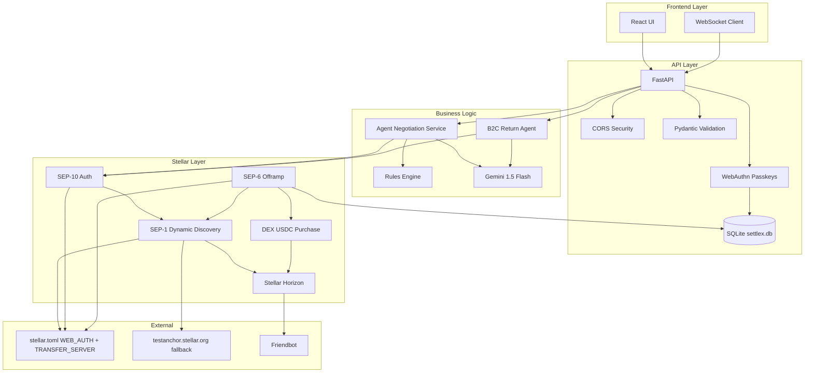
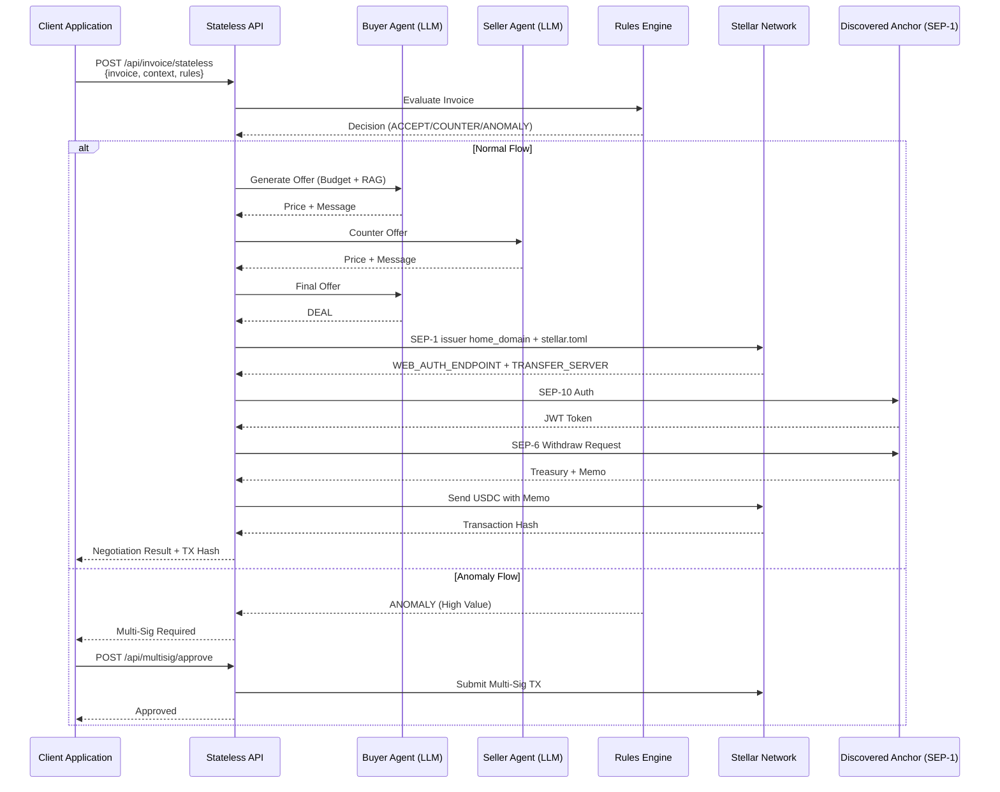
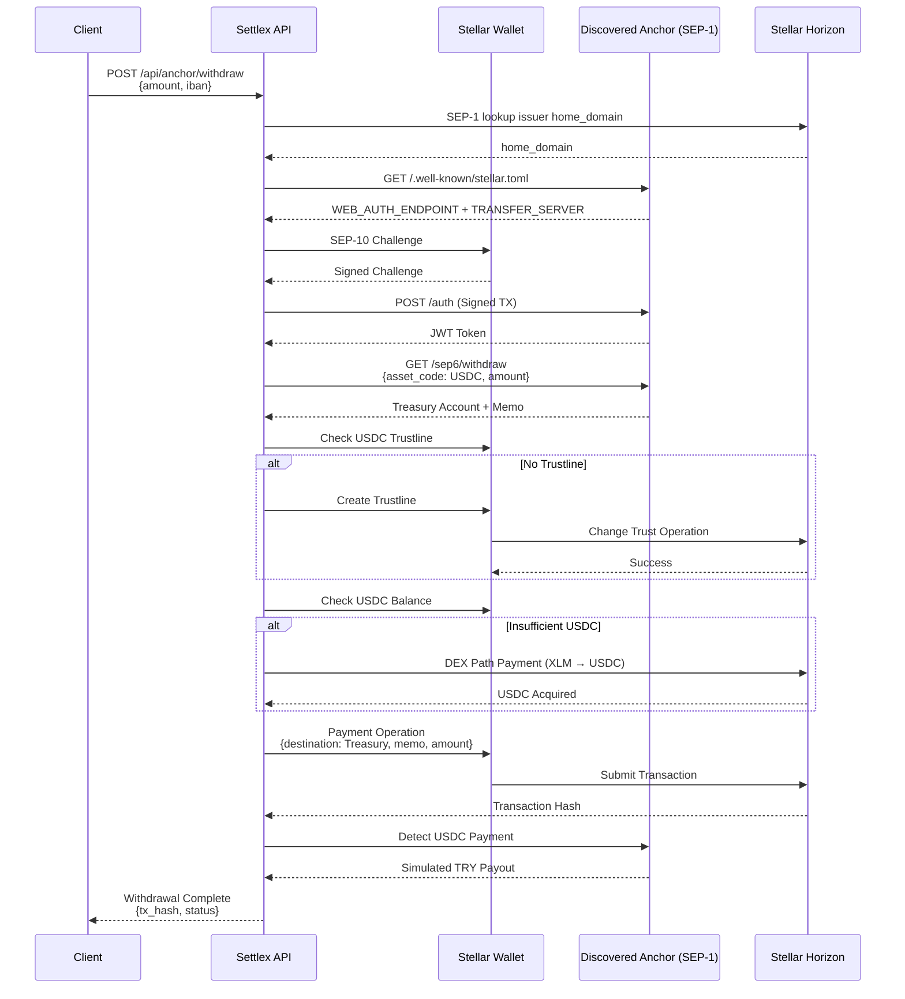

# Settlex 🚀
### Autonomous AI Negotiation & Instant On-Chain Settlement

**A submission for the Rise In × Stellar Pro Hackathon 2026 · Genesis Track**

---

## 🌟 Overview

**Settlex** is a next-generation autonomous payment orchestrator designed to eliminate the friction of financial disputes and invoice reconciliation. By leveraging **Gemini 1.5 Flash** agents and the **Stellar Network**, Settlex automates complex negotiations for both B2B procurement and B2C customer returns.

The system doesn't just talk—it settles. Every successful negotiation culminates in an automated on-chain transaction via **Stellar SEP-6**, ensuring that once agents agree on a price, the money moves instantly and transparently.

## 🎯 The Narrative (Why Settlex?)

### The Problem
In B2B e-commerce and supply chains, inter-company invoice reconciliations and return processes take weeks and create high operational costs. Manual negotiations, multiple approval layers, and complex payment reconciliation workflows slow down business operations and create cash flow bottlenecks.

### Value Proposition
Settlex uses LLM-based autonomous agents to resolve price and invoice negotiations between two companies in seconds without human intervention, ensuring instant on-chain settlement via the Stellar network. By automating the entire negotiation-to-payment pipeline, we eliminate friction, reduce operational overhead, and provide transparency through blockchain records.

### Target Audience
- **B2B Companies:** Procurement teams and supply chain managers
- **Suppliers:** Vendors seeking faster payment reconciliation
- **Enterprise Finance Departments:** Organizations needing automated invoice processing and payment orchestration

### 🎯 Hackathon Context

- **Event:** Rise In × Stellar Pro Hackathon 2026
- **Track:** Genesis Track
- **Date:** September 19-20, 2026
- **Location:** Grand Pera, Beyoğlu, Istanbul
- **Fiat rail:** Production-ready Dynamic SEP-1 Anchor Discovery (issuer `home_domain` → `stellar.toml` → live `WEB_AUTH_ENDPOINT` / `TRANSFER_SERVER`; official `testanchor.stellar.org` fallback)
- **Architecture:** **Stateless API** - Enterprise-grade, context-based, no internal state storage
- **Network:** Stellar Testnet
- **Asset:** USDC (GBBD47IF6LWK7P7MDEVSCWR7DPUWV3NY3DTQEVFL4NAT4AQH3ZLLFLA5)

---

## ✨ Key Features

### 🤝 Dual-Agent Negotiation Protocol
Watch in real-time as a "Buyer Agent" and a "Seller Agent" negotiate terms over WebSockets. They analyze budgets, rules, and market conditions to reach a fair "Deal" without human intervention.

### 🧠 On-the-Fly In-Memory RAG
Our agents aren't just smart; they have memory. Instead of relying on a heavy vector database, we designed an **On-the-Fly In-Memory RAG** architecture suitable for our stateless API. Past invoices provided in the API request are dynamically converted to vectors using Gemini's `text-embedding-004` model, and NumPy computes cosine similarity to retrieve the most relevant Top-3 invoices for prompt injection into the agent's memory.

### 🛡️ Multi-Sig CFO Safeguards
For high-value transactions or suspicious anomalies, Settlex triggers a **Multi-Sig sequence**. The payment is frozen on the Stellar ledger until a human administrator (CFO) provides the second signature via a secure dashboard.

### 💸 Autonomous Split Refunds (B2C)
Settlex introduces the **Karma İade (Split Refund)** logic. If a customer wants a partial cash refund and partial store credit, the agents calculate the split, verify return shipping requirements, and execute the SEP-6 offramp for the cash portion automatically.

### 🌍 Fully Bilingual (TR/EN)
A unified interface and backend that supports seamless switching between Turkish and English. The AI agents dynamically adjust their negotiation tone, language, and cultural nuances based on the user's preference.

### 🔒 Enterprise-Grade Stateless API
Settlex is built as a **stateless API engine** - perfect for enterprise integration. All context (rules, past invoices, wallet keys) is provided by the client in each request. Negotiation logic stays request-scoped; SQLite is used only for Passkeys and post-settlement traction (tx hashes).

### 🗄️ SQLite Traction Store
Successful on-chain settlements are persisted in SQLite (`users`, `webauthn_credentials`, `negotiation_sessions`). Each paid session stores the Stellar `tx_hash` so judges can audit real ledger activity.

### 🔐 Passkeys (WebAuthn)
Users must **Login with Passkey** (FaceID / TouchID / Windows Hello) before triggering AI negotiation agents. Invoice and return APIs require a Bearer session issued after WebAuthn verification.

### 🔗 Clickable Stellar Expert Proof
When settlement succeeds, the console shows a glowing link: `https://stellar.expert/explorer/testnet/tx/<TX_HASH>`.

### 🛰️ Production-ready Dynamic SEP-1 Anchor Discovery
Anchors are no longer hardcoded. Settlex looks up the asset issuer on Horizon, reads `home_domain`, fetches `/.well-known/stellar.toml`, and routes SEP-10 / SEP-6 through the discovered `WEB_AUTH_ENDPOINT` and `TRANSFER_SERVER`. Native XLM and strict testing fall back to the official Stellar testnet anchor (`testanchor.stellar.org`).

---

## 🏗️ Architecture

### Tech Stack

| Layer | Technology | Purpose |
|-------|-----------|---------|
| **Backend** | Python / FastAPI | High-performance async API |
| **AI Engine** | Gemini 1.5 Flash / text-embedding-004 | LLM-powered negotiation agents & vector embeddings |
| **Vector Search** | NumPy 2.1.3 | Cosine similarity for RAG retrieval |
<<<<<<< HEAD
| **Blockchain** | Stellar SDK 12.1.0 | SEP-1 discovery, SEP-6 offramps, SEP-10 auth, Multi-Sig |
=======
| **Blockchain** | Stellar SDK 12.1.0 | SEP-6 Offramps, SEP-10 Auth, Multi-Sig |
| **Persistence** | SQLite + SQLAlchemy 2.0.36 | Users, Passkeys, NegotiationSession + `tx_hash` |
| **Auth** | WebAuthn 2.5 (`webauthn`) | Passkeys (FaceID / TouchID / Windows Hello) |
>>>>>>> bonus-ozellikler
| **Frontend** | React 19 / Vite 8 / Tailwind CSS 4 | Real-time agent console |
| **WebSocket** | Native WebSocket | Live agent communication + settlement events |
| **Validation** | Pydantic 2.10 | Enterprise-grade input validation |
| **HTTP Client** | httpx 0.28.1 | Horizon + stellar.toml + SEP-6/SEP-10 requests |

### System Architecture



---

## 🔄 B2B Negotiation Flow



---

## 💰 SEP-10/SEP-6 Off-Ramp Flow



---

## 🚀 Getting Started

### Prerequisites

- **Python:** 3.11+ (3.9+ with `tomli` if needed)
- **Node.js:** 18+
- **Platform authenticator:** FaceID, TouchID, or Windows Hello (Passkeys)
- **Google AI API Key:** [Get Gemini API Key](https://makersuite.google.com/app/apikey)
- **Stellar Wallet:** [Freighter](https://freighter.app) or [demo-wallet.stellar.org](https://demo-wallet.stellar.org)

### Environment Configuration

Create a `.env` file in the `backend/` directory. You can copy the provided `.env.example` as a template:

```bash
cp backend/.env.example backend/.env
```

Then edit `backend/.env` with your values:

```env
# Required
GEMINI_API_KEY=your_gemini_api_key_here

# Optional: Gemini model (default: gemini-1.5-flash)
GEMINI_MODEL=gemini-1.5-flash

# Stellar Configuration
STELLAR_NETWORK=TESTNET
STELLAR_SECRET_KEY=  # Optional: Auto-generated if not provided

# CORS Security (comma-separated origins)
ALLOWED_ORIGINS=http://localhost:5173,http://localhost:3000,http://127.0.0.1:5173

# SQLite traction DB (default: backend/.data/settlex.db)
# DATABASE_URL=sqlite:///./.data/settlex.db

# Passkeys / WebAuthn
# WEBAUTHN_RP_ID=localhost
# WEBAUTHN_ORIGIN=http://127.0.0.1:5173

# Dynamic SEP-1 discovery (no hardcoded mock anchor)
# ASSET_CODE=USDC
# ASSET_ISSUER=GBBD47IF6LWK7P7MDEVSCWR7DPUWV3NY3DTQEVFL4NAT4AQH3ZLLFLA5
# ANCHOR_MODE=testing          # optional: force official testanchor.stellar.org
# ANCHOR_HOME=testanchor.stellar.org  # optional: pin a fiat-rail domain
# HORIZON_URL=https://horizon-testnet.stellar.org
# FRIENDBOT_URL=https://friendbot.stellar.org
```

### Backend Setup

```bash
cd backend

# Create virtual environment
python -m venv venv

# Activate virtual environment
source venv/bin/activate  # On Windows: venv\Scripts\activate

# Install dependencies from requirements.txt
pip install -r requirements.txt

# Start the server
python -m app.main
```

**Backend will run on:** `http://127.0.0.1:8000`

**API Documentation:** `http://127.0.0.1:8000/docs` (Swagger UI)

**Quick Start:** Use the provided `dev.sh` script to start both backend and frontend simultaneously:
```bash
./dev.sh all
```

### Frontend Setup

```bash
cd frontend

# Install dependencies
npm install

# Start development server
npm run dev
```

**Frontend will run on:** `http://127.0.0.1:5173`

---

## 📡 API Endpoints

### Stateless API (Recommended for New Integrations)

#### B2B Invoice Negotiation
```http
POST /api/invoice/stateless
Authorization: Bearer <passkey-session>
Content-Type: application/json

{
  "invoice": {
    "supplier": "Kağıt Tedarik A.Ş.",
    "product": "bardak",
    "quantity": 500,
    "amount": 480.0
  },
  "context": {
    "past_invoices": [
      {
        "supplier": "Kağıt Tedarik A.Ş.",
        "product": "bardak",
        "amount": 400.0,
        "date": "1 month ago"
      }
    ],
    "rules": [
      {
        "id": "rule-123",
        "supplier": "Kağıt Tedarik A.Ş.",
        "budget_limit": 450.0,
        "anomaly_threshold": 900.0,
        "product_hint": "bardak"
      }
    ],
    "wallet_public_key": "GABCD...XYZ"
  },
  "lang": "tr"
}
```

#### B2C Return Negotiation
```http
POST /api/return/stateless
Authorization: Bearer <passkey-session>
Content-Type: application/json

{
  "return_request": {
    "text": "Siyah Deri Ceket, 5000 TL",
    "lang": "tr"
  },
  "context": {
    "wallet_public_key": "GABCD...XYZ"
  }
}
```

### Legacy API (Backward Compatible)

| Endpoint | Method | Description |
|----------|--------|-------------|
| `/api/invoice` | POST | Submit invoice (stateful) |
| `/api/return` | POST | Submit return (stateful) |
| `/api/rules` | GET/POST/DELETE | Rule management |
| `/api/rules/parse` | POST | Parse natural language rule |
| `/api/negotiations` | GET | List negotiations |
| `/api/anomaly/approve` | POST | Approve anomaly |
| `/api/anomaly/reject` | POST | Reject anomaly |
| `/api/multisig/approve` | POST | Approve multi-sig |
| `/api/balance` | GET | Get wallet balance |
| `/api/wallet/fund` | POST | Fund wallet (Friendbot) |
| `/api/wallet/connect` | POST | Connect wallet |
| `/api/sep10/challenge` | POST | Get SEP-10 challenge |
| `/api/sep10/token` | POST | Get SEP-10 token |
| `/api/anchor/withdraw` | POST | SEP-6 withdraw |
| `/api/transactions` | GET | In-memory transaction history |
| `/api/sessions` | GET | SQLite NegotiationSession history (`tx_hash`) |
| `/api/passkey/register/options` | POST | WebAuthn registration challenge |
| `/api/passkey/register/verify` | POST | Verify Passkey registration |
| `/api/passkey/login/options` | POST | WebAuthn login challenge |
| `/api/passkey/login/verify` | POST | Verify Passkey login (issues session) |
| `/api/passkey/me` | GET | Current Passkey session |
| `/api/passkey/logout` | POST | Revoke Passkey session |
| `/api/logs` | GET | System logs |

### WebSocket Endpoints

| Endpoint | Description |
|----------|-------------|
| `/ws/agent-console` | Live agent negotiation, `anchor_step`, and `settlement` (`tx_hash`) events |
| `/ws/agents` | Buyer/seller agent mesh network |

---

## 🛠️ Usage Flow

### 1. Onboarding
- **Login with Passkey** (FaceID / TouchID / Windows Hello) — required before agents run
- Connect your Stellar wallet or let the system auto-generate a funded Testnet account
- Friendbot automatically funds your account with XLM

### 2. Define Rules
- Set your corporate spending limits (e.g., "Max 500 TL for office supplies")
- Rules can be defined via natural language or form interface

### 3. Trigger Negotiation
- **B2B:** Submit an invoice from a supplier (`Authorization: Bearer` Passkey session)
- **B2C:** Start a customer return request

### 4. The Console
- Open the **Agent Console** to see the agents negotiate in real-time
- Watch buyer and seller agents exchange offers
- View RAG-driven arguments based on past invoices

### 5. Settlement
- Once a "DEAL" is reached, the system automatically:
<<<<<<< HEAD
  - Discovers the fiat rail via **SEP-1** (issuer `home_domain` → `stellar.toml`)
  - Authenticates via SEP-10 on the discovered `WEB_AUTH_ENDPOINT`
  - Initiates SEP-6 off-ramp on the discovered `TRANSFER_SERVER`
  - Sends USDC on-chain to the anchor treasury
  - Anchor completes the fiat payout path (or official testnet fallback)
=======
  - Authenticates via SEP-10
  - Initiates SEP-6 off-ramp
  - Sends USDC on-chain to the anchor treasury
  - Persists `tx_hash` in SQLite (`negotiation_sessions`)
  - Surfaces a clickable Stellar Expert URL: `https://stellar.expert/explorer/testnet/tx/<TX_HASH>`
>>>>>>> bonus-ozellikler

### 6. Verification
- Verify the transaction on [Stellar Expert](https://stellar.expert)
- Check transaction history in the Balance page

---


## 🔒 Security Features

### Enterprise-Grade Error Handling

All errors return standardized JSON responses with appropriate HTTP status codes:

```json
{
  "success": false,
  "error": "Error message",
  "error_code": "ERROR_CODE",
  "details": [
    {
      "field": "field_name",
      "message": "Detailed error message",
      "code": "error_code"
    }
  ],
  "timestamp": "2026-09-17T15:14:00"
}
```

### CORS Security

- Environment-based origin whitelist
- Default: `http://localhost:5173,http://localhost:3000,http://127.0.0.1:5173`
- Configurable via `ALLOWED_ORIGINS` env variable

### Input Validation

- Pydantic models with strict validation
- Field length constraints
- Pattern matching (IBAN, Stellar public keys)
- Range validation (amounts, quantities)

### API Key Protection

- No API keys stored in code
- Environment variable configuration
### Passkey Session
- Invoice and return endpoints require `Authorization: Bearer <token>` after WebAuthn login
- SQLite stores users, credentials, and settlement `tx_hash` under `backend/.data/` (gitignored)

---

## 📊 Error Codes

| Error Code | Description | HTTP Status |
|------------|-------------|-------------|
| `MISSING_API_KEY` | GEMINI_API_KEY not configured | 422 |
| `LLM_QUOTA_EXCEEDED` | Gemini API quota exceeded | 429 |
| `LLM_TIMEOUT` | LLM API connection timeout | 504 |
| `SEP10_CHALLENGE_ERROR` | SEP-10 challenge request failed | 400 |
| `SEP10_AUTH_ERROR` | SEP-10 authentication failed | 401 |
| `ANCHOR_TIMEOUT` | Anchor server timeout | 504 |
| `DEX_PATH_ERROR` | DEX path query failed | 502 |
| `ACCOUNT_NOT_FOUND` | Stellar account not found | 404 |
| `TRANSACTION_ERROR` | Stellar transaction failed | 400 |
| `VALIDATION_ERROR` | Input validation failed | 422 |
| `PASSKEY_REQUIRED` | Login with Passkey before triggering agents | 401 |
| `WEBAUTHN_REGISTER_FAILED` | Passkey registration verification failed | 400 |
| `WEBAUTHN_LOGIN_FAILED` | Passkey login verification failed | 400 |

---

## 🧪 Testing

### Manual Testing

1. **Health Check**
   ```bash
   curl http://127.0.0.1:8000/api/health
   ```

2. **Test Stateless Invoice**
   ```bash
   curl -X POST http://127.0.0.1:8000/api/invoice/stateless \
     -H "Content-Type: application/json" \
     -H "Authorization: Bearer <passkey-session>" \
     -d '{
       "invoice": {"supplier": "Test", "product": "item", "quantity": 1, "amount": 100},
       "context": {"past_invoices": [], "rules": [], "wallet_public_key": null},
       "lang": "tr"
     }'
   ```

3. **Test WebSocket**
   ```bash
   wscat -c ws://127.0.0.1:8000/ws/agent-console
   ```

---

## 📚 Production-ready Dynamic SEP-1 Anchor Discovery

Settlex does **not** hardcode a mock anchor URL. The fiat rail is resolved at runtime:

1. Read the asset issuer (default: testnet USDC `GBBD47IF6LWK7P7MDEVSCWR7DPUWV3NY3DTQEVFL4NAT4AQH3ZLLFLA5`).
2. Query Stellar Horizon for the issuer's on-chain `home_domain`.
3. Fetch `https://<home_domain>/.well-known/stellar.toml`.
4. Extract `WEB_AUTH_ENDPOINT` (SEP-10) and `TRANSFER_SERVER` (SEP-6).
5. If the asset is native XLM, `ANCHOR_MODE=testing`, or the issuer TOML has no transfer endpoints, fall back to the official Stellar testnet anchor: **`testanchor.stellar.org`**.

### Anchor Details

- **Discovery:** Production-ready Dynamic SEP-1 Anchor Discovery
- **Fallback home domain:** `testanchor.stellar.org`
- **Network:** Stellar Testnet (or Public when `STELLAR_NETWORK=PUBLIC`)
- **Asset:** USDC (configurable via `ASSET_CODE` / `ASSET_ISSUER`)
- **USDC Issuer:** `GBBD47IF6LWK7P7MDEVSCWR7DPUWV3NY3DTQEVFL4NAT4AQH3ZLLFLA5`

### SEP Standards Implemented

- **SEP-1:** Dynamic `stellar.toml` discovery from issuer `home_domain`
- **SEP-6:** Deposit/Withdraw against the discovered transfer server
- **SEP-10:** Challenge-response authentication against the discovered web auth endpoint
- **SEP-12:** KYC as published by the discovered anchor
- **SEP-38:** Price quotes when advertised in `stellar.toml`

---

## 🌐 Resources

- **SEP-1 Stellar Info File:** [https://developers.stellar.org/docs/tokens/stellar-toml](https://developers.stellar.org/docs/tokens/stellar-toml)
- **Official Testnet Anchor:** [https://testanchor.stellar.org](https://testanchor.stellar.org)
- **Test Anchor stellar.toml:** [https://testanchor.stellar.org/.well-known/stellar.toml](https://testanchor.stellar.org/.well-known/stellar.toml)
- **Stellar Developer Docs:** [https://developers.stellar.org](https://developers.stellar.org)
- **Stellar Lab:** [https://lab.stellar.org](https://lab.stellar.org)
- **Stellar Expert:** [https://stellar.expert](https://stellar.expert)
- **Stellar Expert (testnet tx):** [https://stellar.expert/explorer/testnet](https://stellar.expert/explorer/testnet)
- **WebAuthn / Passkeys:** [https://webauthn.guide](https://webauthn.guide)
- **Circle USDC Faucet:** [https://faucet.circle.com](https://faucet.circle.com)
- **Stellar AI Skills:** [https://skills.stellar.org](https://skills.stellar.org)

## 📚 Resources & Stellar Skills Used

This project was built referencing the official Stellar build skills. Specifically, we utilized:
- `skills/agentic-payments/SKILL.md` (For LLM agent negotiation flows)
- `skills/standards/SKILL.md` (For SEP-6 deposit/withdraw mock anchor integration architecture)

---

## 🤝 Contributing

This is a hackathon submission. For inquiries or collaboration, please contact the development team.

---

## 👥 Team (Who Built It)

| Name | Role |
|------|------|
| **Musa Ok** | Lead Backend & AI Agent Developer |
| **Şahin Kara** | Technical Documentation & Architecture |
| **Delil Çiya Avcı** | Product Strategy & Presentation |

---

## 📄 License

MIT License - Developed for the Rise In × Stellar Pro Hackathon 2026

---

## 🙏 Acknowledgments

- **Rise In** for organizing the hackathon
- **Stellar Development Foundation** for the blockchain infrastructure
- **Google** for Gemini 1.5 Flash AI
- **Mock Anchor Team** for the testnet TRY/USDC ramp

---

## 🗺️ Post-Hackathon Roadmap

| Timeline | Milestone |
|----------|-----------|
| **Q4 2026** | Transition from testnet mock anchor to a real TR fiat anchor integration (e.g., stablecoin TRYB). |
| **Q1 2027** | Implementation of advanced escrow logic using Soroban smart contracts. |
| **Q2 2027** | Stellar Community Fund (SCF) application and mainnet launch. |

---

**Developed with ❤️ for the Stellar Community**

*Built for the Rise In × Stellar Pro Hackathon 2026 · Genesis Track*
